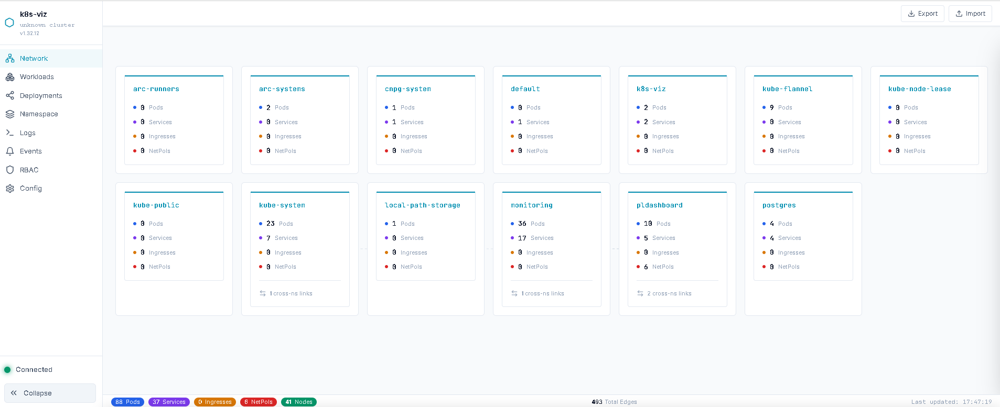

# k8s-viz

**Real-time Kubernetes cluster visualization and debugging tool.**

k8s-viz models your entire cluster as a live directed graph — mapping pods, services, ingresses, and NetworkPolicies with their relationships. Trace simulated network paths between any pod and service, visualize workload health, stream logs, and understand your cluster's network topology at a glance.



---

## Why k8s-viz?

Managing Kubernetes clusters with complex NetworkPolicies via CLI and manifests is painful. k8s-viz gives you a visual interface to instantly understand what can talk to what, how traffic flows, and where your workloads live.

- No more cross-referencing label selectors across YAML files
- No more guessing whether a NetworkPolicy allows or blocks traffic
- No more `kubectl get` / `kubectl describe` loops across 10 terminal tabs

---

## Features

### Network Topology

Visual graph of your cluster's network layer — services, pods, ingresses, and the connections between them. See which services select which pods, which ingresses route to which services, and how NetworkPolicies control traffic flow.

### Packet Tracer

Simulate the full network path from any pod to any service. Each hop is shown with technical details:

1. **Source Pod** — IP and node placement
2. **CoreDNS** — resolves service FQDN (reads your actual Corefile)
3. **kube-proxy** — auto-detects iptables, IPVS, or eBPF mode
4. **Load Balancing** — lists all healthy endpoints
5. **CNI Routing** — auto-detects Flannel, Calico, Cilium, Weave, or kindnet
6. **NetworkPolicy** — evaluates ingress/egress rules on the path
7. **Destination Pod** — final endpoint after DNAT

### NetworkPolicy Visualization

See exactly which pods a policy selects, what ingress/egress rules are defined, and which peers are allowed — without reading a single line of YAML.

### Workloads Dashboard

Deployments, StatefulSets, DaemonSets, Jobs, and CronJobs — all with health status, replica counts, pod details, container specs, and events.

### Deployment Map

Click any deployment to see everything connected to it: pods (grouped by replica set), services, ingresses, NetworkPolicies, ConfigMaps, Secrets, ServiceAccounts, and the nodes pods are running on.

### Namespace Map

Full resource inventory for any namespace — workloads, services, ingresses, policies, config, and RBAC — all on one screen.

### Log Streaming

Real-time log tailing per pod or aggregated across all pods in a deployment, interleaved by timestamp.

### RBAC Viewer

Roles, ClusterRoles, RoleBindings, and ClusterRoleBindings with detailed rules tables.

---

## Quick Start

### Prerequisites

- Kubernetes cluster (v1.24+)
- Helm 3
- `kubectl` configured with cluster access

### Install

```bash
# Clone the repo
git clone https://github.com/tamhid92/k8s-viz.git
cd k8s-viz

# Install via Helm
helm install k8s-viz ./helm/k8s-viz \
    --namespace k8s-viz \
    --create-namespace
```

### Access

```bash
# Get the NodePort
kubectl -n k8s-viz get svc k8s-viz-frontend -o jsonpath='{.spec.ports[0].nodePort}'

# Or port-forward
kubectl -n k8s-viz port-forward svc/k8s-viz-frontend 8080:80
```

Then open `http://localhost:8080` in your browser.

### Uninstall

```bash
helm uninstall k8s-viz -n k8s-viz
kubectl delete namespace k8s-viz
```

---

## Architecture

```
┌─────────────────────────────────────────────────────┐
│                    Browser (React)                   │
│  Topology │ Workloads │ Logs │ RBAC │ Trace │ Config │
└──────────────────────┬──────────────────────────────┘
                       │ WebSocket + REST
┌──────────────────────┴──────────────────────────────┐
│                  Backend (Flask)                      │
│                                                      │
│  ┌──────────┐  ┌──────────┐  ┌─────────────────┐   │
│  │  Graph    │  │ Resource │  │    Workload      │   │
│  │  Builder  │  │  Cache   │  │    Builder       │   │
│  └────┬─────┘  └────┬─────┘  └────────┬────────┘   │
│       │              │                  │            │
│  ┌────┴──────────────┴──────────────────┴────────┐  │
│  │              Kubernetes API Client             │  │
│  │         (Watch threads per resource type)      │  │
│  └────────────────────┬──────────────────────────┘  │
└───────────────────────┴─────────────────────────────┘
                        │
              Kubernetes API Server
```

**Graph Builder** — Builds a directed graph of the cluster on startup, then maintains it in real-time via Watch API events. Nodes represent resources (pods, services, ingresses, NetworkPolicies, namespaces, cluster nodes). Edges represent relationships (label selector matches, ingress routing rules, policy rules).

**Resource Cache** — In-memory cache of 19 resource types, synchronized via Watch API. Powers the workload views without repeated API calls.

**Packet Tracer** — Simulates network paths by reading the graph and querying cluster configuration (CoreDNS Corefile, kube-proxy ConfigMap, kube-system pod labels for CNI detection).

---

## Configuration

### Helm Values

```yaml
# Backend
backend:
  image:
    repository: ghcr.io/tamhid92/k8s-viz-backend
    tag: "latest"
  replicaCount: 1
  resources:
    requests:
      cpu: 100m
      memory: 256Mi
    limits:
      cpu: 500m
      memory: 512Mi

# Frontend
frontend:
  image:
    repository: ghcr.io/tamhid92/k8s-viz-frontend
    tag: "latest"
  replicaCount: 1
  service:
    type: NodePort
```

See [`helm/k8s-viz/values.yaml`](helm/k8s-viz/values.yaml) for all options.

### RBAC

k8s-viz requires **read-only** cluster access. The Helm chart creates a ClusterRole with `get`, `list`, `watch` permissions on:

- Core API: pods, pods/log, services, endpoints, nodes, namespaces, events, configmaps, secrets, serviceaccounts
- Apps: deployments, statefulsets, daemonsets, replicasets
- Batch: jobs, cronjobs
- Networking: ingresses, networkpolicies
- Discovery: endpointslices
- RBAC: roles, clusterroles, rolebindings, clusterrolebindings

No create, update, or delete permissions. k8s-viz is strictly read-only.

---

## Local Development

### Backend

```bash
cd backend
pip install -r requirements.txt
python -m app.main
```

Connects to your local kubeconfig by default. Runs on port 5000.

### Frontend

```bash
cd frontend
npm install
npm run dev
```

Runs on port 5173 with hot reload. Proxies API requests to the backend.

---

## Supported Environments

k8s-viz has been tested on:

- kubeadm clusters (bare metal / VM)
- K3s clusters (including ARM64)
- Works in-cluster (deployed via Helm) and out-of-cluster (local development via kubeconfig)

### CNI Detection

Automatically detects: Flannel, Calico, Cilium, Weave, kindnet, Canal

### kube-proxy Mode Detection

Automatically detects: iptables, IPVS, eBPF (Cilium without kube-proxy)

---

## API Reference

| Method | Endpoint | Description |
|--------|----------|-------------|
| GET | `/api/v1/graph` | Full cluster graph |
| GET | `/api/v1/graph/snapshot` | Lightweight snapshot |
| GET | `/api/v1/trace?from=&to=` | Packet trace simulation |
| GET | `/api/v1/workloads/deployments` | Deployments with health |
| GET | `/api/v1/workloads/statefulsets` | StatefulSets with health |
| GET | `/api/v1/workloads/daemonsets` | DaemonSets with health |
| GET | `/api/v1/workloads/jobs` | Jobs with status |
| GET | `/api/v1/workloads/cronjobs` | CronJobs with schedule |
| GET | `/api/v1/workloads/events` | Cluster events |
| GET | `/api/v1/workloads/deployment-map/{ns}/{name}` | Deployment resource map |
| GET | `/api/v1/workloads/namespace-map/{ns}` | Namespace resource map |
| GET | `/api/v1/resources/{type}` | ConfigMaps, Secrets, SA, RBAC |
| GET | `/api/v1/describe?kind=&name=&namespace=` | Resource describe |
| GET | `/api/v1/logs/pod/{ns}/{name}` | Pod logs |
| GET | `/api/v1/logs/pod/{ns}/{name}/stream` | Pod log stream (SSE) |
| GET | `/api/v1/logs/deployment/{ns}/{name}` | Aggregated deployment logs |
| WS | `graph_delta` | Real-time graph updates |

---

## Contributing

Contributions welcome. Please open an issue first to discuss what you'd like to change.

1. Fork the repo
2. Create a feature branch (`git checkout -b feature/your-feature`)
3. Commit your changes
4. Push to the branch
5. Open a Pull Request

---

## License

[MIT](LICENSE)